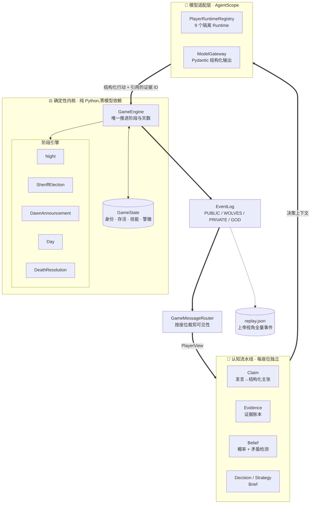
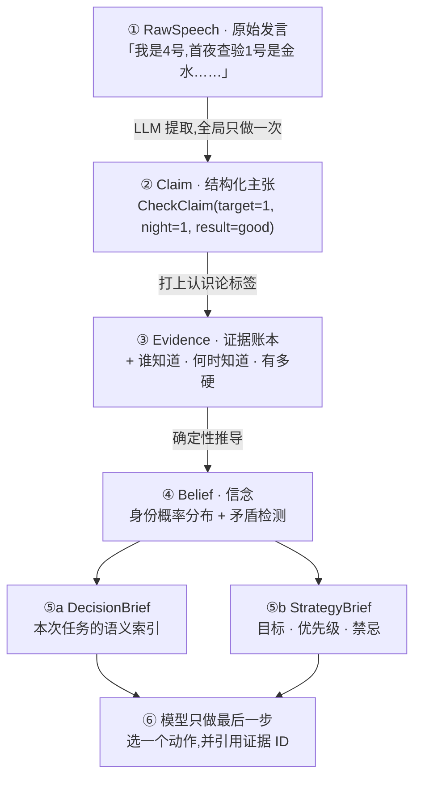
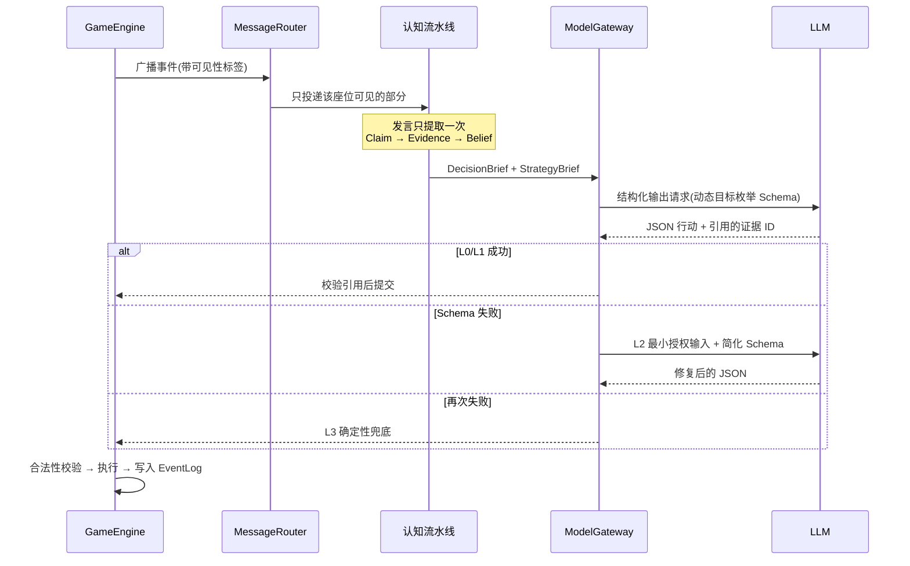

# WolfScope

> **让九个 AI 在不完全信息下互相博弈、说谎与推理**

基于 [AgentScope](https://github.com/modelscope/agentscope) 的九人狼人杀多智能体博弈与评测系统。

做这个项目的真实目的是**学习多智能体交互,并尝试复杂的 agent 推理策略** —— 狼人杀只是载体,它逼着你面对协作类任务遇不到的问题:信息必须真隔离、agent 必须会说谎、而且**结果可以用胜负和数据来检验**。

架构上是「**确定性 Python 裁判 + 九个座位隔离 Agent**」:身份、夜间结算、可见性和胜负判断由引擎独占;LLM 只能读取自己的 `PlayerView`,并通过严格 Schema 提交一次结构化行动。固定 seed 可复现,完整上帝视角事件流写入 JSON Replay。

项目**不做 Web 前端** —— 交付形态是 README、评测报告和可复现的 Replay。理由见[项目反思](#三项目反思)。

---

## 项目概述

| | |
|---|---|
| **性质** | 多智能体博弈与评测,已结项 |
| **目的** | 学习多 agent 交互 · 尝试结构化的复杂推理策略 |
| **技术栈** | Python 3.11 · AgentScope 2.0.5 · Pydantic 结构化输出 · DeepSeek |
| **规模** | 九人屠边局全规则实现 · **204 项自动化测试** · 54 次提交 |
| **核心成果** | 522 次真实模型决策下 **97.3%** 结构化成功率;完整对局可 seed 复现 |
| **关键设计** | 四级事件可见性 · 五层认知流水线 · 三级降级兜底 · 规则内核零模型依赖 |

---

## 一、问题与动机

### 1.1 为什么用狼人杀学多 agent

多智能体的 demo 大多跑**协作**任务 —— 几个 agent 分工完成一件事。协作有个隐蔽的便利:**信息可以随便共享**,共享得越多效果往往越好。所以很多所谓的多 agent 系统,本质上是「一个模型分饰多角」。

狼人杀不允许这样:

| 特征 | 逼出来的工程问题 |
|---|---|
| 每人只知道自己的身份 | 信息隔离必须是**硬的**,不能靠提示词约束 |
| 狼人必须伪装 | Agent 要能主动生成不实陈述,且前后不能穿帮 |
| 发言是唯一的公共信息 | 长对话必须能被结构化,否则推理无从下手 |
| 有明确胜负 | **结果可量化**,不必靠「看起来不错」判断 |

最后一条决定了这个项目能不能算「实验」而不只是「demo」。

### 1.2 第一版暴露的六个问题

这不是从零开始的项目。第一版已经做出了能跑的九人局:确定性规则引擎、事件日志、私有视图、LLM 玩家、JSON 复盘,还做了**手写编排**和 **LangGraph 编排**两套对照实现。

它证明了架构可行,但也暴露出更值得研究的问题:

| # | 第一版的问题 |
|---|---|
| 1 | LLM 需要反复从长篇自然语言历史中**恢复事实**,容易遗漏关键信息 |
| 2 | 玩家缺少显式的证据、立场和身份概率表示,所谓「记忆」其实就是**原始对话** |
| 3 | 狼人杀策略全写在 Prompt 里,**难以按身份、阶段、局面精确调用** |
| 4 | 规则判断、概率计算、票型分析也交给 LLM,结果**不稳定且不可验证** |
| 5 | 发言生成与决策推理耦合,出现**信息泄漏、身份矛盾、言行不一** |
| 6 | 单局案例只能说明现象,**缺少批量实验**来量化设计的实际效果 |

所以第二版不是重写,也不是把模型调用换成 AgentScope API,而是**重新设计玩家 Agent 的认知结构**,并用可重复实验验证它到底有没有用。

### 1.3 核心研究问题

> 与「完整历史 + 单次 Prompt」的基础 Agent 相比,**结构化信念、策略检索、概率工具和反思机制**,能否显著提升 LLM Agent 在不完全信息博弈中的**决策质量、逻辑一致性和信息纪律**?

三个难点贯穿始终:

**其一:信息隔离靠提示词是不牢的。** 把上帝状态传给每个 agent、再在 prompt 里叮嘱「只能用属于你的信息」—— 模型会泄漏,而且**泄漏了你也发现不了**:它的推理看起来依然合理,只是结论好得不正常。

**其二:长对话没法直接拿来推理。** 一局到第三天,公开发言累计上万字。全文塞回上下文既贵又抓不住重点,而且同一段话被反复重读,每次的理解还可能不一致。

**其三:模型输出不稳定,但规则引擎不能崩。** LLM 会返回坏 JSON、会投给死人、会用掉不存在的技能。引擎必须在这些情况下**保持状态一致**。

---

## 二、解决方案

### 2.1 系统架构

核心是一条分界线:**规则归引擎,语言归模型,两者之间只有结构化契约。**



**三条设计原则:**

1. **上帝状态不出引擎** —— Agent 拿到的永远是路由裁剪过的 `PlayerView`,物理上够不到 `GameState`
2. **规则与策略解耦** —— 引擎只判合法性,不判优劣;策略层只提供粗粒度方法,不改状态
3. **规则内核零模型依赖** —— `Engine`、`PlayerView`、`Evidence`、`Replay` 都不依赖 AgentScope 类型,**所以规则测试不需要模型也不需要网络**

### 2.2 认知流水线:从一句话到一个决定

这是整个项目里最核心的部分,也是第一版六个问题的集中回答。

想法很简单:**不要把一大段发言直接丢给模型让它又读又想又决定**,而是拆成五层,每层只做一件事,且每层的产物都是**结构化、可追溯、可测试**的。



#### ① → ② 把发言变成 Claim

一段自然语言,被提取成最多 8 条**带类型的结构化主张**:

| Claim 类型 | 含义 |
|---|---|
| `RoleClaim` | 声称某人是某角色 |
| `CheckClaim` | 声称某夜查验了某人、结果是什么 |
| `AlignmentClaim` | 声称某人是好人/狼 |
| `StanceClaim` | 对某人的态度(支持/反对/信任/怀疑) |
| `VoteIntentClaim` | 我打算投谁 / 我避开谁 |
| `VoteRecommendationClaim` | 建议大家投谁 |

两个关键设计:

**每条 Claim 必须附带原文片段(`supporting_text`),而且会被校验。** 投票类 Claim 的校验器会检查:原文里**真的出现了那个座位号**,并且**真的出现了投票动作的词**(投/票/放逐/vote/exile)。对不上就整条拒绝,并计入 `rejected_claims`。

> 这是一道**防编造**的闸门 —— 模型不能凭空说「7号说要投3号」,它必须指出这句话在原文的哪里。

**一句发言只被提取一次,九个座位共用这份结果。** 提取是纯语义任务、和身份无关,重复解析既贵又可能得出不一致的理解。所以:**共享的是「他说了什么」,不共享的是「我怎么想」。**

#### ② → ③ Claim 变成 Evidence:加上认识论标签

Claim 只是「有人说了什么」。要能推理,还得知道**这条信息有多硬**。每条证据带三组元数据:

| 维度 | 取值 | 意义 |
|---|---|---|
| **认识论状态** | `verified` / `observed` / `claimed` | 引擎认证 / 我亲身经历 / 别人声称 |
| **来源方式** | `engine` / `rule_derivation` / `llm` | 引擎给的 / 规则推的 / 模型提取的 |
| **两个时间戳** | `occurred_at` vs `known_at` | **事情发生的时刻 ≠ 我知道的时刻** |

第三条最容易被忽略却很要命:预言家首夜的查验发生在 D1 夜,别人是 D2 白天才听说 —— 不区分这两个时间,推理就会出现**「我早该知道」的时序错觉**。

隔离也做在了 ID 上:证据编号形如 `p4-e7`(4 号座位的第 7 条证据)。**座位号写死在 ID 里,一旦串号,测试立刻能发现。**

#### ③ → ④ Evidence 汇成 Belief:并自动找矛盾

信念层为每个座位维护**身份概率分布**(狼/民/预言家/女巫/猎人)和信任分,每条信念都记录 `supporting_evidence_ids` —— **任何判断都能回溯到具体证据**。

更有用的是它**确定性地检测三类矛盾**:

| 矛盾类型 | 抓的是什么 |
|---|---|
| `UniqueRoleCounterclaimConflict` | 两个人都跳预言家 —— 必有一个说谎 |
| `SelfRoleClaimConflict` | 同一个人前后说的身份不一致 |
| **`VoteBehaviorConflict`** | **说要投 A,实际投了 B** |

最后一类是最有价值的狼人杀信号:**言行不一是最难伪装的破绽**。而这件事**根本不需要模型判断** —— 比对「声明的投票意图」和「引擎记录的实际投票」就能算出来,零成本、零幻觉。

#### ④ → ⑤ 两份 Brief:但都不替模型做决定

送进模型的是两份材料,分工明确:

**`DecisionBrief`** —— 当前任务相关的语义索引:候选人及其狼概率、身份声称、查验声明、已发现的矛盾、最新投票意图与立场。代码注释写得很直白:

> *Build a compact semantic index **without making a voting recommendation**.*

**`StrategyBrief`** —— 角色目标、至多 3 条优先级、至多 5 条方法、至多 3 条禁忌,外加一组 `SituationTag`。这些标签的注释同样克制:

> *Small deterministic facts used to select strategies, **never conclusions**.*

标签只描述可观察事实(单预言家起跳 / 出现对跳 / 自己被压 / 自己收到查杀 / 残局压力……),**不下结论**。

狼队还额外共享一份 `WolfTeamPlan`:今天的目标(藏 / 悍跳 / 施压)、由谁起跳、跳什么身份、假查验报谁,以及每只狼的站位 —— `claimant` 悍跳 / `support` 帮跳 / `distance` 拉开距离 / `hide` 深水。这是狼队协作的最小共享结构,**不做成策略树**,避免把博弈变成执行脚本。

#### ⑥ 最后一步:模型必须引用证据

模型返回的每个决定,除了动作本身,还要带上 `evidence_ids`、`event_ids`、`strategy_ids` —— **它凭什么这么决定**。

系统会逐条比对:这些 ID 是否真的存在于**该座位**的账本里。对不上的被剔除,并记入 `invalid_evidence_ids`。

```python
valid_evidence_ids = set(decision_input.available_evidence_ids)
invalid_evidence_ids = tuple(
    eid for eid in submitted_evidence_ids if eid not in valid_evidence_ids
)
```

这一步把「防幻觉」从提示词变成了**可执行的校验**,而且顺带产出了一个可分析的指标:**模型引用的证据里,有多少来自 Brief、多少来自上下文、多少是编的。**

### 2.3 核心流程:一次决策与三级降级



**四个复杂度档位不是重试次数,而是不同的输入投影:**

| 档位 | 什么时候用 | 给模型什么 |
|---|---|---|
| `L0 FULL` | 狼人、预言家、女巫、猎人默认 | 完整授权认知输入 |
| `L1 COMPACT` | 普通村民默认 | Brief 已概括的不再重发,白天发言只留最近三条原文 |
| `L2 MINIMAL_REPAIR` | 结构化失败后 | 只留玩家状态、合法任务字段、局面标签、最高优先级方法 |
| `L3 DETERMINISTIC` | 再次失败 | 不再调模型,按确定性标签生成合法动作 |

几个值得说的细节:

- **村民会被临时升档**:被公开查杀、本人受压、进入五人残局、PK 或遗言时,`L1 → L0`
- **非法目标进不来**:对有候选人的动作,Gateway 会**动态生成目标枚举 Schema** —— 投给死人这种事在 Schema 层就被挡住,而不是等引擎拒绝
- **L3 不会把别人的声称升级为事实**:兜底时预言家优先用自己的真实查杀,狼人优先跟团队目标,实在没有确定性依据才弃票

---

### 2.4 效果展示

#### 真实对局:seed 15,好人险胜

评测里唯一一局好人获胜。九个 agent 全程自主决策,无脚本干预。

```
角色  1猎人  2平民  3狼  4预言家  5平民  6狼  7狼  8女巫  9平民

D1   预言家验 1 号 → 金水          放逐 2 号(平民)  ✗ 错杀
D2   预言家验 5 号 → 金水          5 号被刀
     放逐 6 号(狼)  ✓
D3   预言家验 7 号 → 查杀          预言家被刀
     放逐 7 号(狼)  ✓
D4   猎人被刀,开枪带走 3 号(最后一只狼)  →  好人胜
```

**第一天,真预言家(4号)的发言里出现了这么一句:**

> 我是4号,真预言家,现任警长。首夜我查验1号,结果是金水,这是我自己的真实查验,归属明确。……
> **今晚我准备在 6、7、9 这些发言偏模板化的人里选一个验**,明天报结果。
> 请大家继续把查验归属分清,**不要把我没发表的查验安到我头上**。

两处值得注意:

- **6 和 7 确实是狼。** 模型没有任何身份信息,从「发言偏模板化」这个特征反推出怀疑对象,并据此安排查验顺序 —— 而且验中了。
- 「不要把我没发表的查验安到我头上」正是 **2.2 里认识论边界**的直接体现:系统严格区分「引擎认证的事实」和「玩家声称的内容」,预言家自己也在防止被冒认。

#### 结项评测:8 局固定 seed

| 指标 | 结果 |
|---|---:|
| 完成对局 | 8 / 8 |
| 玩家决策 | 522 次 |
| **最终结构化成功率** | **97.3%** |
| 首次成功率 | 83.1% |
| L2 修复 / L3 兜底 | 14.2% / 2.7% |
| 放逐投票弃票率 | 1.5% |
| 猎人开枪 | 6 / 7 次机会 |
| **预言家把警徽传给自己验出的狼** | **0 次** |
| 好人 / 狼人胜利 | 1 / 7 |

最后两行是刻意放在一起的:

**「警徽传给已验狼人:0 次」** 是可靠性指标 —— 这类低级错误一次没发生,说明认知流水线里的查验归属确实生效了。

**「好人 1 胜 7 负」是没有被隐藏的失败。** 8 局样本不足以估计真实阵营胜率,但方向性结果说明:**共享信息较少的好人如何形成稳健共识,这个问题还没解决。** 它是明确保留的后续方向,不是被藏起来的数据。

📄 [完整评测报告](artifacts/evaluation/portfolio-final-v1/report.md) · [seed 15 完整 Replay](artifacts/evaluation/portfolio-final-v1/replays/seed-15.json)

#### 稳定性:204 项测试,规则部分不需要模型

因为规则内核不依赖 AgentScope,**整套规则测试离线可跑、秒级完成**,覆盖:确定性规则内核、警长竞选、夜间角色、死亡技能链、完整多日终局、Replay 往返,以及 EvidenceLedger、公共 Claim、警徽流、查验归属、悍跳时间线、座位 ID 隔离、失败降级和评测聚合。

---

## 三、项目反思

### 3.1 最有价值的一个决定:砍掉 Web 前端

原计划有 M4 阶段做在线对局界面,做到一半重新评估后**决定不做**([ADR-003](docs/decisions/ADR-003-backend-first-portfolio.md))。

依据很简单:核心问题是「结构化认知机制能否提升不完全信息博弈表现」,而 Web 前端对回答这个问题**没有任何贡献** —— 它只让 demo 更好看。

省下的时间投到 Agent 设计、可靠性和实验上。代价是没有在线体验,收益是 204 项测试和一份真实评测报告。**对一个以学习和验证为目的的项目,后者更重要。**

### 3.2 「确定性裁判」是所有可靠性的前提

[ADR-001](docs/decisions/ADR-001-deterministic-referee.md) 决定由纯 Python 引擎独占规则裁决,回报比预想的大:

| 收益 | 说明 |
|---|---|
| 规则可离线测试 | 不要模型、不要网络、不烧 token |
| 非法行动不破坏状态 | 模型再怎么胡来,局面始终合法 |
| **变量可分离** | Agent 表现的变化能和规则实现的变化**分开分析** |

最后一条才是关键。如果规则和策略混在一起,某局输了你根本不知道是策略差还是规则写错了 —— **实验就失去了意义**。

### 3.3 学到的:结构化的边界在哪里

做完最大的体会是:**结构化不是越多越好,关键在于把「组织信息」和「做出判断」分开。**

流水线做了很多事 —— 提取、归档、算概率、找矛盾、给标签 —— 但它**始终不给结论**:`DecisionBrief` 不推荐投票,`SituationTag` 只标事实不下判断,`StrategyBrief` 只给粗粒度方法。判断留给模型。

这条界线是有代价的(工程量大得多),但换来两件事:**打得离谱时能分辨是信息组织错了还是模型判断差**;以及**这些确定性部分全都能写测试**。

### 3.4 已知的不足

- **发言同质化。** 从 seed 15 能明显看出,多个玩家的发言结构高度相似(「我是X号,平民」「不会盲目跟票」「先过」)。狼人的伪装因此不够自然 —— 讽刺的是,真预言家正是靠这一点找到了狼。
- **好人阵营共识机制弱。** 见 2.4 的胜率数据。
- **样本量小。** 8 局只够验收工程稳定性,不够做统计结论。
- **消融实验没做完。** 立项书里设想的「基础 Agent vs 结构化 Agent」对照,受限于成本和时间没有完整跑完 —— **所以「结构化是否真的更好」目前只有工程稳定性证据,没有胜率证据。**

---

## 四、未来方向

| 方向 | 说明 |
|---|---|
| **补上消融实验** | 直接对应 3.4 最后一条,是最该先做的 |
| **扩大评测样本** | 当前 8 局仅够工程验收 |
| **校准好人共识** | 对应 3.4 里最大的那个问题 |
| **失败样本驱动的 Claim 标注集** | 用真实失败案例反过来改进发言解析 |
| **更精细的对手模型** | 让狼人的伪装不再模板化 |
| **扩展角色与板子** | 当前只实现九人屠边局 |

明确**不在**后续范围内:Web 对局前端(理由见 3.1)、按身份路由不同模型档位。

---

## 五、AgentScope 用在哪里

AgentScope 位于**模型适配层**,不进规则内核:

- `PlayerRuntimeRegistry` 为 1–9 号座位创建**隔离 Runtime**,各自持有独立的调用记录,避免共享私有上下文
- `AgentScopeModelGateway` 调用模型并请求 Pydantic 结构化输出;对有候选人的动作**动态生成目标枚举 Schema**
- 同一个 Gateway 同时服务「玩家决策」与「公共 Claim 提取」,但两者**拥有独立的 Schema、Trace 和失败诊断**
- Thinking / non-thinking、token 预算、超时和复杂度降级由**任务类型**控制,而不是按角色路由不同模型
- `ScriptedProvider` 不参与正式对局,仅作为无需 API 的确定性回归工具

每次模型调用都会记录:座位、任务、是否 thinking、延迟、重试次数、token 用量、失败阶段与原因、以及**被接受和被拒绝的证据引用** —— 这些构成了评测报告的原始数据。

---

## 当前功能

- 标准九人屠边局:3 狼人、3 平民、预言家、女巫、猎人
- 首夜技能结算后先竞选警长,再公布首夜死亡
- 狼人自刀、预言家查验、女巫救毒限制
- 警长竞选、退水、1.5 票权、发言方向和警徽移交
- 白天发言、基础自爆、同时投票、平票 PK 和一次重投
- 猎人死亡链、被毒禁枪和枪杀目标无遗言
- 屠狼、屠神、屠民胜负判断;同批次同时达成时好人优先
- PUBLIC / WOLVES / PRIVATE / GOD 四级事件可见性
- 分阶段发言长度限制(不规定发言结构,只在超限时于句末截断)
- seed 固定发牌、发言顺序和确定性 Replay

---

## 本地运行

需要 Python 3.11 或更高版本。

```bash
python -m venv .venv
source .venv/bin/activate
python -m pip install -e .
```

### 跑一局确定性验收对局(不需要 API)

```bash
wolfscope-m1 all --output-dir replays --overwrite
```

内置四个确定性剧本:

| 剧本 | 预期结果 |
|---|---|
| `good-win-seed-42` | 好人消灭全部狼人 |
| `wolves-eliminate-deities-seed-42` | 狼人屠神 |
| `wolves-eliminate-civilians-seed-42` | 狼人屠民 |
| `hunter-tie-break-seed-42` | 猎人开枪后双方同时达成条件,好人优先 |

每局生成一个 `replays/<game-id>.json`,包含全员身份、最终结果、存活座位和完整四级事件流。

### 跑测试(不需要 API)

```bash
python -m unittest discover -s tests
```

### 跑真实 Agent 评测(需要 API)

配置 `.env.local` 后:

```bash
set -a && source .env.local && set +a
wolfscope-eval --seeds 1,2,3 --output-dir artifacts/evaluation/flash-baseline-v1
```

每局结束增量保存,中断后可 `--resume` 恢复;`--aggregate-only` 可在不调用 API 的情况下重新聚合报告。

---

## 项目文档

| 文档 | 内容 |
|---|---|
| [项目立项书](PROJECT_PROPOSAL.md) | 完整立项、研究问题与里程碑规划 |
| [架构决策记录](docs/decisions/) | ADR-001 确定性裁判 · ADR-002 座位级消息路由 · ADR-003 后端优先交付 |
| [M2-2 EvidenceLedger 设计](docs/M2_2_EVIDENCE_DESIGN.md) | 证据账本的结构与隔离 |
| [M2-3 信念设计](docs/M2_3_BELIEF_DESIGN.md) | 概率分布与矛盾检测 |
| [M2-8 复杂度与降级](docs/M2_8_COMPLEXITY_POLICY.md) | 四个档位与三级降级 |
| [M3-1 自动对局评测](docs/M3_1_GAME_EVALUATION.md) | 评测口径与指标定义 |
| [规则对比与最终规则](docs/RULES_COMPARISON.md) | 各版本规则差异与最终选择 |
| [第一版缺陷回归矩阵](docs/V1_REGRESSION_MATRIX.md) | 1.2 里六个问题的逐条修复对照 |

---

## 使用条款

本仓库作为个人作品集公开,**代码仅供浏览与学习,保留所有权利**。
