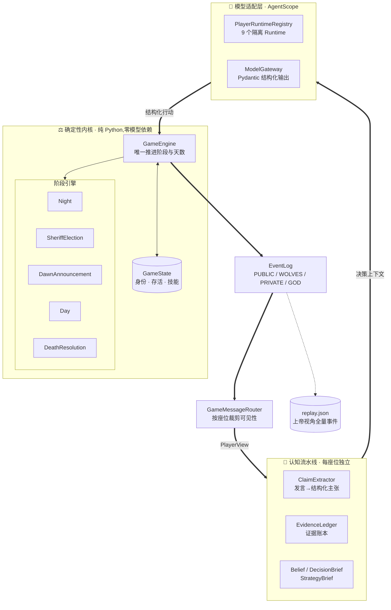
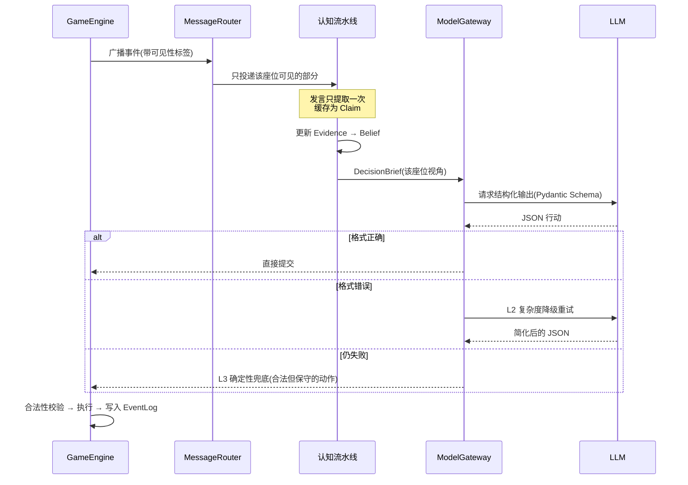

# WolfScope

> **让九个 AI 在不完全信息下互相博弈、说谎与推理**

基于 [AgentScope](https://github.com/modelscope/agentscope) 的九人狼人杀多智能体项目。它关注的不是「让九个模型轮流聊天」,而是三个更难的工程问题:**如何严格隔离每名玩家的信息**、**如何把长对话转化成可审计的证据**、**如何让不稳定的模型输出安全地驱动确定性规则引擎**。

架构上是「**确定性 Python 裁判 + 九个座位隔离 Agent**」:身份、夜间结算、可见性和胜负判断由引擎独占;LLM 只能读取自己的 `PlayerView`,并通过严格 Schema 提交一次结构化行动。固定 seed 可复现,完整上帝视角事件流写入 JSON Replay。

项目**不做 Web 前端** —— 交付形态是 README、评测报告和可复现的 Replay。这个取舍的理由见[项目反思](#三项目反思)。

---

## 项目概述

| | |
|---|---|
| **性质** | 多智能体博弈与评测,已结项 |
| **技术栈** | Python 3.11 · AgentScope 2.0.5 · Pydantic 结构化输出 · DeepSeek |
| **规模** | 九人屠边局全规则实现 · **204 项自动化测试** · 54 次提交 |
| **核心成果** | 522 次真实模型决策下 **97.3%** 结构化成功率;完整对局可 seed 复现 |
| **关键设计** | 四级事件可见性 · 认知流水线 · 三级降级兜底 · 规则内核零模型依赖 |

---

## 一、问题与动机

### 1.1 为什么用狼人杀

多智能体系统的论文和 demo 很多,但大部分跑的是**协作**任务 —— 几个 agent 分工完成一件事。协作任务有个隐蔽的便利:**信息可以随便共享**,共享得越多效果往往越好。

狼人杀反过来。它是一个**对抗性、不完全信息、且必须说谎**的场景:

| 特征 | 带来的工程约束 |
|---|---|
| 每个人只知道自己的身份 | 信息隔离必须是**硬的**,不能靠提示词约束 |
| 狼人必须伪装成好人 | Agent 要能主动生成不实陈述,且不能穿帮 |
| 发言是唯一的公共信息 | 长对话必须能被结构化,否则推理无从下手 |
| 有明确胜负 | **结果可量化**,不需要人工打分 |

最后一条尤其重要:大多数 agent 项目的效果只能靠「看起来不错」来判断,而这里有胜负、有票型、有技能命中率 —— **可以拿数据说话**。

### 1.2 三个真正难的地方

做下来发现,难点不在「让模型会玩狼人杀」,而在这三处:

**其一:信息隔离靠提示词是不牢的。**

最直觉的做法是把上帝视角状态传给每个 agent,再在 prompt 里叮嘱「你只能用属于你的信息」。这不可靠 —— 模型会泄漏,而且**泄漏了你也发现不了**:它的推理看起来依然合理,只是结论好得不正常。

**其二:长对话没法直接拿来推理。**

一局到第三天,公开发言累计上万字。把全文塞回上下文,模型既贵又抓不住重点;而且同一段发言被反复重读,每次的理解还可能不一致。

**其三:模型输出不稳定,但规则引擎不能崩。**

LLM 会返回格式错误的 JSON、会投给已死亡的玩家、会用掉不存在的技能。规则引擎必须在这些情况下**保持状态一致**,而不是崩溃或产生非法局面。

---

## 二、解决方案

### 2.1 系统架构

核心是一条分界线:**规则归引擎,语言归模型,两者之间只有结构化契约。**



**三条设计原则:**

1. **上帝状态不出引擎** —— Agent 拿到的永远是路由裁剪过的 `PlayerView`,物理上够不到 `GameState`
2. **规则与策略解耦** —— 引擎只判合法性,不判优劣;策略层只提供粗粒度方法,不改状态
3. **规则内核零模型依赖** —— `Engine`、`PlayerView`、`Evidence`、`Replay` 都不依赖 AgentScope 类型,**所以规则测试不需要模型也不需要网络**

### 2.2 核心流程:一次决策的旅程



关键在三处:**可见性在路由层就裁剪掉了**、**发言只解析一次**、**模型失败有确定性兜底**。

### 2.3 效果展示

#### 真实对局:seed 15,好人险胜

这是评测里唯一一局好人获胜。九个 agent 全程自主决策,没有任何脚本干预。

```
角色  1猎人  2平民  3狼  4预言家  5平民  6狼  7狼  8女巫  9平民

D1   预言家验 1 号 → 金水          放逐 2 号(平民)  ✗ 错杀
D2   预言家验 5 号 → 金水          5 号被刀
     放逐 6 号(狼)  ✓
D3   预言家验 7 号 → 查杀          预言家被刀
     放逐 7 号(狼)  ✓
D4   猎人被刀,开枪带走 3 号(最后一只狼)  →  好人胜
```

**第一天,真预言家(4号)的发言里出现了这么一句:**

> 我是4号,真预言家,现任警长。首夜我查验1号,结果是金水,这是我自己的真实查验,归属明确。……
> **今晚我准备在 6、7、9 这些发言偏模板化的人里选一个验**,明天报结果。
> 请大家继续把查验归属分清,**不要把我没发表的查验安到我头上**。

两处值得注意:

- **6 和 7 确实是狼。** 模型没有任何身份信息,是从「发言偏模板化」这个特征反推出了怀疑对象,并据此安排了查验顺序 —— 而且验中了。
- 「不要把我没发表的查验安到我头上」是**认识论边界**的直接体现:系统严格区分「引擎认证的事实」和「玩家声称的内容」,预言家自己也在防止被冒认。

#### 结项评测:8 局固定 seed

| 指标 | 结果 |
|---|---:|
| 完成对局 | 8 / 8 |
| 玩家决策 | 522 次 |
| **最终结构化成功率** | **97.3%** |
| 首次成功率 | 83.1% |
| L2 修复 / L3 兜底 | 14.2% / 2.7% |
| 放逐投票弃票率 | 1.5% |
| 猎人开枪 | 6 / 7 次机会 |
| **预言家把警徽传给自己验出的狼** | **0 次** |
| 好人 / 狼人胜利 | 1 / 7 |

最后两行是刻意放在一起的:

**「预言家警徽传给已验狼人:0 次」** 是可靠性指标 —— 这类低级错误一次都没发生,说明认知流水线里的查验归属确实生效了。

**「好人 1 胜 7 负」是没有被隐藏的失败。** 8 局样本不足以估计真实阵营胜率,但这个方向性结果说明:**共享信息较少的好人如何形成稳健共识,这个问题还没解决。** 它是明确保留的后续方向,不是被藏起来的数据。

📄 [完整评测报告](artifacts/evaluation/portfolio-final-v1/report.md) · [seed 15 完整 Replay](artifacts/evaluation/portfolio-final-v1/replays/seed-15.json)

#### 稳定性:204 项测试,规则部分不需要模型

因为规则内核不依赖 AgentScope,**整套规则测试离线可跑、秒级完成**,覆盖:确定性规则内核、警长竞选、夜间角色、死亡技能链、完整多日终局、Replay 往返,以及 EvidenceLedger、公共 Claim、警徽流、查验归属、悍跳时间线、座位 ID 隔离、失败降级和评测聚合。

---

## 三、项目反思

### 3.1 最有价值的一个决定:砍掉 Web 前端

原计划有 M4 阶段做在线对局界面。做到一半时重新评估,**决定不做**([ADR-003](docs/decisions/ADR-003-backend-first-portfolio.md))。

判断依据很简单:这个项目的核心问题是「**认知增强机制是否提升不完全信息博弈表现**」,而 Web 前端对回答这个问题**没有任何贡献** —— 它只会让 demo 更好看。

省下的时间投到了 Agent 设计、可靠性和实验上。代价是没有在线体验,收益是有了 204 项测试和一份真实评测报告。**对一个研究性项目,后者更重要。**

### 3.2 「确定性裁判」是所有可靠性的前提

[ADR-001](docs/decisions/ADR-001-deterministic-referee.md) 决定由纯 Python 引擎独占规则裁决。这个决定的回报比预想的大:

| 收益 | 说明 |
|---|---|
| 规则可离线测试 | 不需要模型、不需要网络、不烧 token |
| 非法行动不破坏状态 | 模型再怎么胡来,局面始终合法 |
| **变量可分离** | Agent 表现的变化能和规则实现的变化**分开分析** |

最后一条是真正关键的。如果规则和策略混在一起,某局输了你根本不知道是策略差还是规则写错了 —— **实验就失去了意义**。

### 3.3 已知的不足

- **发言同质化。** 从 seed 15 的记录能明显看出:多个玩家的发言结构高度相似(「我是X号,平民」「不会盲目跟票」「先过」)。狼人的伪装因此不够自然 —— 讽刺的是,真预言家正是靠这一点找到了狼。这既是弱点,也说明当前的伪装能力还很初级。
- **好人阵营共识机制弱。** 见 2.3 的胜率数据。
- **样本量小。** 8 局只够验收工程稳定性,不够做统计结论。

---

## 四、未来方向

| 方向 | 说明 |
|---|---|
| **扩大评测样本** | 当前 8 局仅够工程验收,不足以支撑阵营胜率结论 |
| **校准好人共识** | 直接对应 3.3 里最大的那个问题 |
| **失败样本驱动的 Claim 标注集** | 用真实失败案例反过来改进发言解析 |
| **更精细的对手模型** | 让狼人的伪装不再模板化 |
| **扩展角色与板子** | 当前只实现了九人屠边局 |

明确**不在**后续范围内的:Web 对局前端(理由见 3.1)、按身份路由不同模型档位。

---

## 五、AgentScope 用在哪里

AgentScope 位于**模型适配层**,不进规则内核:

- `PlayerRuntimeRegistry` 为 1–9 号座位创建**隔离 Runtime**,避免共享私有上下文
- `AgentScopeModelGateway` 调用模型并请求 Pydantic 结构化输出
- 同一个 Gateway 同时服务「玩家决策」与「公共 Claim 提取」,但两者**拥有独立的 Schema、Trace 和失败诊断**
- Thinking / non-thinking、token 预算、请求超时和复杂度降级由**任务类型**控制
- `ScriptedProvider` 不参与正式对局,仅作为无需 API 的确定性回归工具

---

## 当前功能

- 标准九人屠边局:3 狼人、3 平民、预言家、女巫、猎人
- 首夜技能结算后先竞选警长,再公布首夜死亡
- 狼人自刀、预言家查验、女巫救毒限制
- 警长竞选、退水、1.5 票权、发言方向和警徽移交
- 白天发言、基础自爆、同时投票、平票 PK 和一次重投
- 猎人死亡链、被毒禁枪和枪杀目标无遗言
- 屠狼、屠神、屠民胜负判断;同批次同时达成时好人优先
- PUBLIC / WOLVES / PRIVATE / GOD 四级事件可见性
- 类型化 ScriptedProvider 和未消费行动审计
- seed 固定发牌、发言顺序和确定性 Replay

---

## 本地运行

需要 Python 3.11 或更高版本。

```bash
python -m venv .venv
source .venv/bin/activate
python -m pip install -e .
```

### 跑一局确定性验收对局(不需要 API)

```bash
wolfscope-m1 all --output-dir replays --overwrite
```

内置四个确定性剧本:

| 剧本 | 预期结果 |
|---|---|
| `good-win-seed-42` | 好人消灭全部狼人 |
| `wolves-eliminate-deities-seed-42` | 狼人屠神 |
| `wolves-eliminate-civilians-seed-42` | 狼人屠民 |
| `hunter-tie-break-seed-42` | 猎人开枪后双方同时达成条件,好人优先 |

每局生成一个 `replays/<game-id>.json`,包含全员身份、最终结果、存活座位和完整四级事件流。

### 跑测试(不需要 API)

```bash
python -m unittest discover -s tests
```

### 跑真实 Agent 评测(需要 API)

配置 `.env.local` 后:

```bash
set -a && source .env.local && set +a
wolfscope-eval --seeds 1,2,3 --output-dir artifacts/evaluation/flash-baseline-v1
```

每局结束增量保存,中断后可 `--resume` 恢复;`--aggregate-only` 可在不调用 API 的情况下重新聚合报告。

---

## 项目文档

| 文档 | 内容 |
|---|---|
| [项目立项书](PROJECT_PROPOSAL.md) | 完整立项与里程碑规划 |
| [架构决策记录](docs/decisions/) | ADR-001 确定性裁判 · ADR-002 座位级消息路由 · ADR-003 后端优先交付 |
| [规则对比与最终规则](docs/RULES_COMPARISON.md) | 各版本规则差异与最终选择 |
| [M2-2 EvidenceLedger 设计](docs/M2_2_EVIDENCE_DESIGN.md) | 证据账本的结构与隔离 |
| [M2-8 复杂度与智能降级](docs/M2_8_COMPLEXITY_POLICY.md) | 三级降级策略 |
| [M3-1 自动对局评测](docs/M3_1_GAME_EVALUATION.md) | 评测口径与指标定义 |
| [第一版缺陷回归矩阵](docs/V1_REGRESSION_MATRIX.md) | 旧版问题与本版修复对照 |

---

## 使用条款

本仓库作为个人作品集公开,**代码仅供浏览与学习,保留所有权利**。
